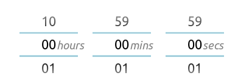

React duration picker for mobile, inspired by Android number pickers. A live demo is available [here](https://flurmbo.github.io/react-duration-picker). Supports keyboard and mouse events in addition to touch. A type declaration file is also included.



# Installation

`npm install react-duration-picker`

Then in your React component:

`import DurationPicker from 'react-duration-picker'`

# API

| Prop            | Type                                                        | Default                            | Description                                                                                  |
| --------------- | ----------------------------------------------------------- | ---------------------------------- | -------------------------------------------------------------------------------------------- |
| onChange        | ({hours: number, minutes: number, seconds: number}) => void | () => {}                           | Callback executed by DurationPicker whenever the duration displayed on the picker is updated |
| initialDuration | {hours: number, minutes: number, seconds: number}           | {hours: 0, minutes: 0, seconds: 0} | Duration to display on first render                                                          |
| maxHours        | number                                                      | 10                                 | Max number of hours that can be selected                                                     |
| noHours         | boolean                                                     | false                              | If true, omits 'hours' column from picker                                                    |

# Example

```javascript
const onChange = duration => {
  const { hours, minutes, seconds } = duration;
  setState({ hours, minutes, seconds });
};

return (
  <Modal open={isOpen}>
    <DurationPicker
      onChange={onChange}
      initialDuration={{ hours: 1, minutes: 2, seconds: 3 }}
      maxHours={5}
    />
    <button onClick={closeModal} />
  </Modal>
);
```

The `example` directory contains the code for the demo.

# Contributing

Contributions and feedback are welcome. Submit bugs or suggestions as an [issue](https://github.com/flurmbo/react-duration-picker/issues) on Github.
